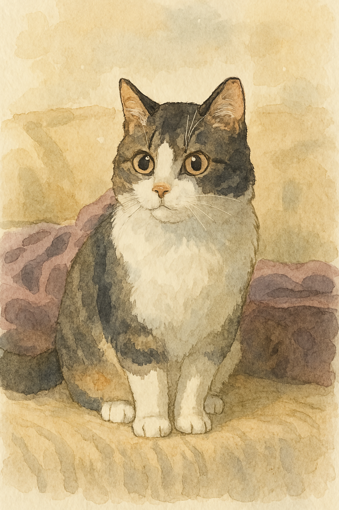

::: {.portada}
::: {.portada-tapa}
{.portada-imagen fig-alt="Acuarela de un gato atigrado, ilustración de la portada."}
:::

::: {.portada-texto}
# Pensar el análisis antes de los datos {.unnumbered .unlisted}

::: {.portada-subtitulo}
Análisis de datos con jamovi para iniciantes
:::

::: {.portada-autor}
Dr. Fernando Tonini
:::

[Ingresar al libro](prefacio.qmd){.portada-boton .no-external}
:::
:::
